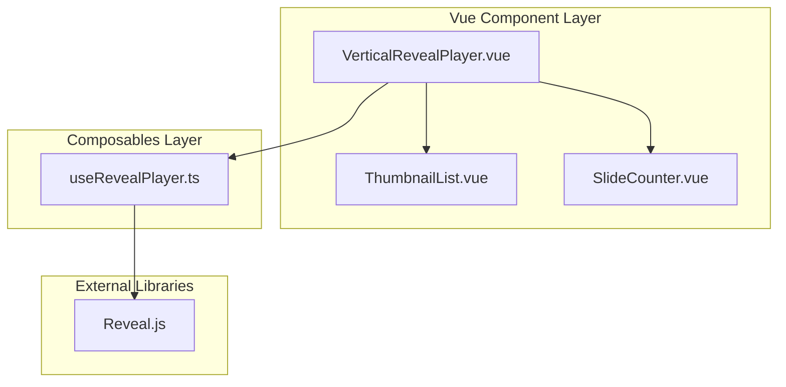

# Design Document: PPTX Reveal Player

## Overview

本设计文档描述基于Reveal.js的PPTX课件播放器实现方案。该播放器支持垂直滚动导航模式，左侧显示可滚动的缩略图列表，右侧显示当前幻灯片内容。

## Architecture



## Components and Interfaces

### VerticalRevealPlayer.vue

```typescript
interface VerticalRevealPlayerProps {
  courseware: Courseware
  initialSlide?: number
  syncMode?: boolean
  isPresenter?: boolean
}
```

### ThumbnailList.vue

```typescript
interface ThumbnailListProps {
  slides: Slide[]
  currentIndex: number
}
```

## Data Models

```typescript
interface Courseware {
  id: string
  title: string
  slides: Slide[]
}

interface Slide {
  id: string
  type: 'title' | 'content' | 'image' | 'list' | 'code' | 'custom'
  title?: string
  content?: string
  html?: string
  imageUrl?: string
  thumbnailUrl?: string
  backgroundColor?: string
}
```

## Correctness Properties

*A property is a characteristic or behavior that should hold true across all valid executions of a system.*

### Property 1: Slide Count Consistency
*For any* courseware with N slides, the player SHALL render exactly N slides and generate exactly N thumbnails.
**Validates: Requirements 1.1, 1.3**

### Property 2: Initial Slide Position
*For any* successfully loaded courseware, the initial current slide index SHALL be 0.
**Validates: Requirements 1.2**

### Property 3: Navigation Consistency
*For any* courseware and any current slide index i, navigation SHALL produce consistent results.
**Validates: Requirements 2.1, 2.2, 2.3**

### Property 4: Thumbnail Click Navigation
*For any* thumbnail at index i, clicking it SHALL set the current slide to index i.
**Validates: Requirements 3.2**

### Property 5: Active Thumbnail Highlighting
*For any* current slide index i, the thumbnail at index i SHALL have active styling.
**Validates: Requirements 3.3**

### Property 6: Slide Counter Format
*For any* courseware with N slides at current index i, display "幻灯片 {i+1}/{N}".
**Validates: Requirements 4.1, 4.2**

## Testing Strategy

- Unit tests: Vitest
- Property tests: fast-check
- Minimum iterations: 100
